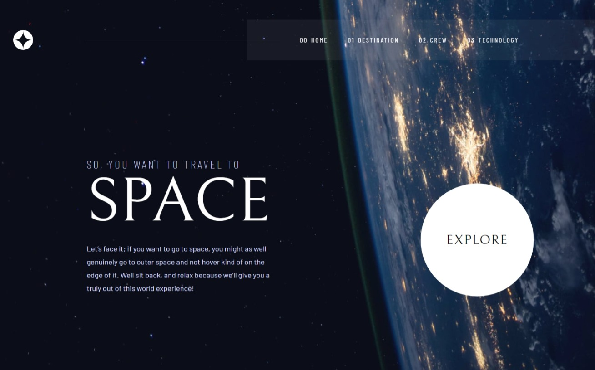
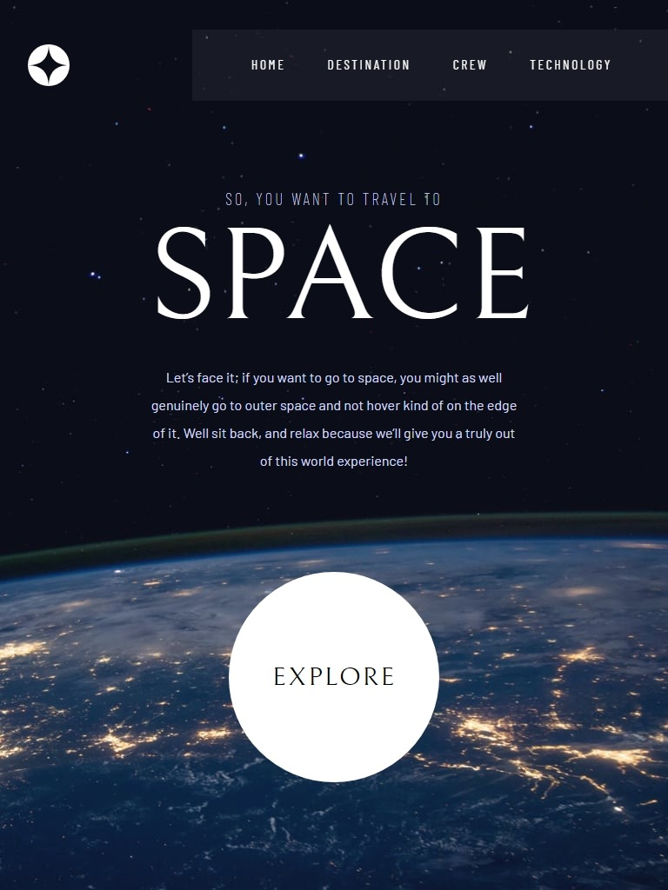
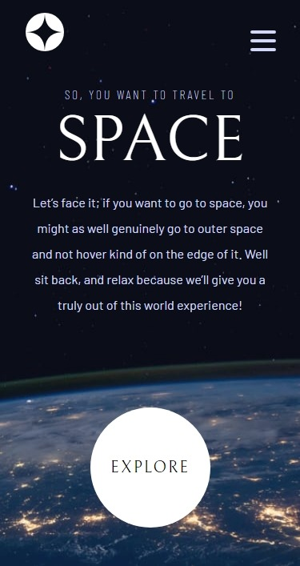

# Frontend Mentor - Space tourism website solution

This is a solution to the [Space tourism website challenge on Frontend Mentor](https://www.frontendmentor.io/challenges/space-tourism-multipage-website-gRWj1URZ3). Frontend Mentor challenges help you improve your coding skills by building realistic projects.

## Table of contents

- [Overview](#overview)
  - [Setup](#setup)
  - [Screenshot](#screenshot)
  - [Links](#links)
- [My process](#my-process)
  - [Built with](#built-with)
  - [What I learned](#what-i-learned)
  - [Continued development](#continued-development)
  - [Useful resources](#useful-resources)
- [Author](#author)
- [Acknowledgments](#acknowledgments)

**Note: Delete this note and update the table of contents based on what sections you keep.**

## Overview

This project was built with Parcel.

### Setup

1.  Install dependencies:

```sh
npm install
```

2.  Run dev server:

```sh
npm start
```

3.  Build for production:

```sh
npm run build
```

### Screenshot

<p align="center">
    
</p>
<p align="center">
  
</p>
<p align="center">
  
</p>

### Links

- Solution URL: [GitHub](https://github.com/ichiklaus/space-tourism-website-main)
- Live Site URL: [Netlify live site](https://ichiklaus-space-tourism.netlify.app/)

## My process

### Built with

- Semantic HTML5 markup
- CSS custom properties
- Flexbox
- CSS Grid
- [React](https://reactjs.org/) - JS library
- [Parcel](https://parceljs.org/) - Parcel build tool
- [Framer Motion](https://www.framer.com/motion/) - For animations

### What I learned

Decided to start a more challenging project to put in practice routing, hooks, props. I took the JS-heavy approach to read the data from the local json file where I had to modify paths values in order to read the correct image since parcel doesn't support path reading to load images in ```  ```. Parcel supports importing images as assets.

### Continued development

- Need to practice grid.
- Need to learn more about CSS animations.

### Useful resources

- Framer Motion and React Documentation.
- [@parcel/resolver-glob](https://stackoverflow.com/questions/69342223/how-to-import-all-images-from-folder-in-js) to import multiple assets globally. Took this approach to dinamically display the content image.

## Author

- Website - [github.com/ichiklaus](https://github.com/ichiklaus)
- Frontend Mentor - [@ichiklaus](https://www.frontendmentor.io/profile/ichiklaus)
- Twitter - [@ichiklaus](https://www.twitter.com/ichiklaus)

## Acknowledgments

Reviewing [@FluffyKas](https://github.com/FluffyKas) code helped me understand how to take the JS-heavy approach and learnt some CSS properties aswell.